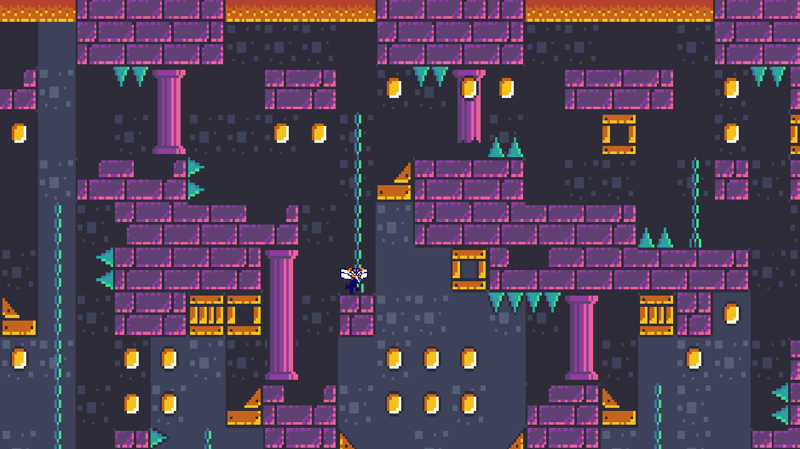

# Sleepwalking

Author: Zi Wang, Wenlin Mao, Tianrun(Martin) Ke

Design: 

Screen Shot:

How To Play:

Use mouse to click buttons to make decision. You can talk to 20 customers max. And your goal is to get $300 in profit.

Sources: 
* Credit List:
    * Audio:
        * BGM
            * https://www.chosic.com/download-audio/27015/
        * Jump
            * https://freesound.org/people/SkyRaeVoicing/sounds/363582/
        * Rotate
            * https://freesound.org/people/Greencouch/sounds/124899/
        * Collect
            * https://freesound.org/people/sapht/sounds/61234/
        * Drag
            * https://freesound.org/people/InspectorJ/sounds/361546/
        * Timestop
            * Clock ticking: https://freesound.org/people/Mortifreshman/sounds/237210/ 
        * Die
            * https://freesound.org/people/Jofae/sounds/364929/
        * Walk
            * https://freesound.org/people/Disagree/sounds/433725/
        * Walk across checkpoint
            *  https://freesound.org/people/Eponn/sounds/528862/
    * Art:
        * Clock, Drag:
            * https://opengameart.org/content/cc0-tool-icons
        * Spell block, health bar
            * https://opengameart.org/content/golden-ui
        * Light:
            * https://opengameart.org/content/flare-effect-blender
        * Save
            * https://www.gameart2d.com/free-candy-buttons.html
        * Thorn
            * Created and distributed by Spriteshift (https://spriteshift.itch.io/)
        * Special Thanks to Qin Zhang for background, characters, collectables, and tiles
        * Rotate Spell
            * https://www.veryicon.com/icons/business/back-stage-management/left-rotation.html
            * https://www.veryicon.com/icons/business/back-stage-management/right-rotation.html
            * https://www.veryicon.com/icons/system/eva-all/flip-2-2.html

This game was built with [NEST](NEST.md).

